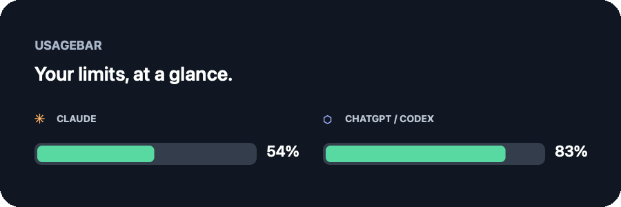

<div align="center">

# UsageBar

### Your AI plan limits, at a glance.

Claude and ChatGPT/Codex usage in a tiny, floating Mac widget—and right in your menu bar.



[**Download for macOS**](https://github.com/icarus2419/UsageBar/releases/latest) · [Features](#what-you-get) · [Privacy](#private-by-design)

</div>

UsageBar turns the usage you already have into a glanceable pair of battery bars. Drag the widget anywhere, let it snap neatly to an edge, or tuck the indicators beside your Mac's own battery in the menu bar.

## Install

On Apple silicon, install directly through the UsageBar Homebrew tap:

```sh
brew install --cask icarus2419/usagebar/usagebar
```

Or download **UsageBar-macos.zip** from [the latest release](https://github.com/icarus2419/UsageBar/releases/latest), unzip it, and move **UsageBar.app** to Applications.

Requires macOS 13 or later. The Homebrew cask and prebuilt release currently target Apple silicon (M1 or later). The first launch may need the standard macOS confirmation for an app downloaded outside the App Store: Control-click UsageBar in Applications, choose **Open**, then confirm.

Open UsageBar. Sign in to Claude Code and/or Codex first; UsageBar picks up their existing login.

Prefer the terminal? With the Xcode Command Line Tools installed, run:

```sh
git clone https://github.com/icarus2419/UsageBar.git
cd UsageBar
make install
```

`make install` builds the app, copies it to `~/Applications`, and opens it. No Xcode project setup or package manager required.

## What you get

- **See what's left.** Bars show remaining allowance. UsageBar automatically highlights whichever is closer to running out: the current session or weekly limit.
- **A widget that fits your screen.** Drag to position, snap to screen edges, choose a horizontal or vertical layout, or keep it above windows and full-screen apps.
- **A useful detail card.** Check every limit, refill countdown, plan, and reading age. Pick Lowest, 5-hour, or Weekly as your main metric.
- **Fast local updates.** Claude refreshes on a selectable interval. Codex can update as soon as its local session writes a fresh usage snapshot.
- **Thoughtful alerts.** Get notified at 20% and 10%, at depletion, and when a limit refills.
- **Your setup, your way.** Adjust providers, size, opacity, colors, refresh, launch at login, and more.

Green means more than 50% remains, yellow means 20–50%, and red means less than 20%.

## Get started

UsageBar reads logins created by the official command-line tools:

- **Claude:** install and sign in to [Claude Code](https://claude.com/claude-code) once by running `claude`.
- **ChatGPT/Codex:** install [Codex](https://github.com/openai/codex) and run `codex login` with your ChatGPT account. API-key logins do not include plan limits.

Open UsageBar and the bars appear. Right-click the widget or menu bar item to explore settings. Choose **Launch at Login** to have it ready after restarting your Mac.

## Private by design

UsageBar reads existing usage information; it does not send prompts or run model requests. It reads the credentials already saved by Claude Code and Codex, keeps them in memory only while checking usage, and sends each token only to its issuing provider. Tokens are never written, refreshed, or rotated. UsageBar has no analytics or third-party dependencies.

The provider usage endpoints are currently undocumented and can change. If one changes, that provider may temporarily show an error while the other keeps working.

## Build it yourself

Requires macOS 13+ and Xcode Command Line Tools (`xcode-select --install`).

| Command | Action |
| --- | --- |
| `make install` | Build, install to `~/Applications`, and launch |
| `make app` | Build `build/UsageBar.app` |
| `make run` | Build and launch from the project folder |
| `make print` | Print current usage in the terminal |
| `make test` | Run the test suite |
| `make uninstall` | Remove UsageBar from `~/Applications` |

The command-line output is also handy in scripts:

```sh
~/Applications/UsageBar.app/Contents/MacOS/UsageBar --short
# ✳ 21%  ⬡ 43%
```

## Troubleshooting

- **“Not signed in”:** sign in with `claude` or `codex login`, then reopen UsageBar.
- **Claude login expired:** open Claude Code once; UsageBar will pick up the refreshed login.
- **Rate limited:** UsageBar waits and retries. A longer refresh interval can help.
- **Widget missing:** choose **Show Widget** from the menu bar item.
- **Widget off screen:** choose **Widget → Reset Position** from the menu bar item.

## How it works

UsageBar fetches Claude usage from Anthropic's usage endpoint using the existing Claude Code login. It fetches ChatGPT/Codex usage from the ChatGPT usage endpoint with Codex's existing login, with a local Codex session-log fallback. Codex log changes are watched on-device; they are never uploaded. Usage polls every two minutes by default, and the interval is configurable.

---

Made for a quieter menu bar and fewer surprise limit resets.
